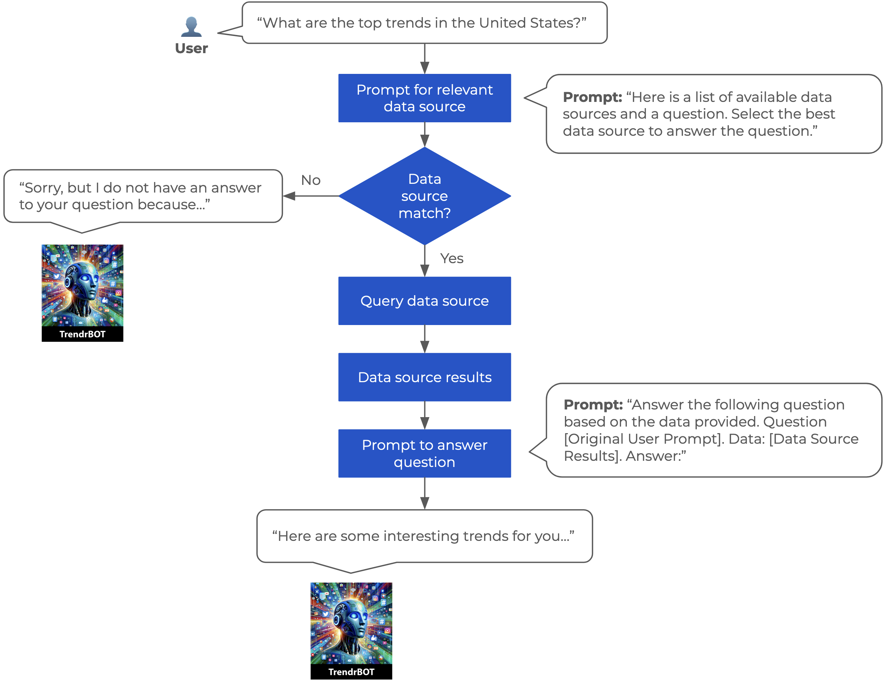
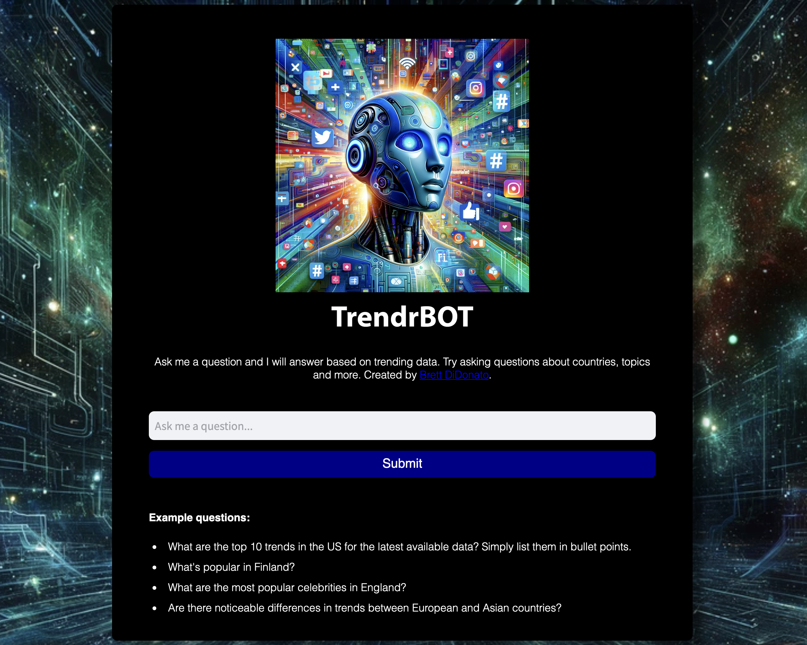

# trendr_bot


<br>

# About

Answer natural language questions about what is trending on Google Search. This project demonstrates how to build a basic AI agent to answer open ended natural language questions by integrating a large amount of structured data with an LLM.

Here is a logical view:



<br>

Explanation:

* **Step 1:** Based on user input, use an LLM to check for a relevant data source
* **Step 2:** Query the matched data source. If relevant data source does not exist, tell the user and bail out.
* **Step 3:** Take the data output results and provide it for context to ask the LLM to answer the question
* **Step 4:** Return the results to the user

<br>

Here is the browser UI once the application is deployed:



<br>

# Demo
Try the live demo hosted on GCP Cloud Run at [tinyurl.com/trendr-bot](http://tinyurl.com/trendr-bot).

<br>

# Setup

Install required packages:

```
pip install -r requirements.txt
```

Depending on your preference, either set your environment variables for Google Cloud:

```
export GCP_PROJECT=
export GCP_REGION=
```

Or update **config.ini**:

```
[Cloud Configs]
GCP_PROJECT = ADD_HERE
```

This application is deployed as a streamlit web interface. Deploy locally as follows:

```
streamlit run app.py \
  --browser.serverAddress=localhost \
  --server.enableCORS=false \
  --server.enableXsrfProtection=false \
  --server.port 8080
```

To deploy on GCP Cloud Run, update the variables in the script **gcp_cloud_run_deploy.sh** and execute:

```
./gcp_cloud_run_deploy.sh
```

# Usage
Once the application is running in the browser you can ask basic questions such as:

```
Question: What are the top 10 trends in the US for the latest available data? Simply list them in bullet points.
```

Answer:

* O.J. Simpson
* Real Madrid vs Man City
* Masters 2024
* Total eclipse 2024
* UFC 300
* Purdue basketball
* Powerball
* PSG vs Barcelona
* Champions League
* What time is the eclipse

<br>
<hr>
<br>

Or you can ask more complex, nuanced questions (with limitations) as well:

```
Question: Are there noticeable differences in trends between European and Asian countries?
```

Answer:

**Trend Differences between Europe and Asia:**

Based on the provided Google Search trends data from the week of April 7, 2024, we can observe some noticeable differences in trending topics between European and Asian countries:

**Europe:**
* **Dominance of Football**: A large portion of the top trends relates to European football leagues and matches, like the Champions League ("Ligue des champions", "Liga Mistrzów", etc.), and specific games like "Man United vs Liverpool". This indicates a strong interest in football within the European region.
* **Solar Eclipse Interest**: Several European countries show interest in the upcoming solar eclipse on April 8th, 2024, with searches like "Eclipsa de Soare 2024 romania" and "Sonnenfinsternis 2024".
* **Regional Events**: Some trends highlight regional events or personalities, such as "Wybory samorządowe 2024" (Polish local elections) and "אבשלום פלד" (an Israeli personality).


**Asia:**
* **Variety of topics**: Compared to Europe, the top trends in Asia exhibit a wider variety of interests. While football ("Man utd Liverpool", "Arsenal đấu với Bayern") and the solar eclipse ("Gerhana matahari 8 April 2024") are present, there's also a mix of entertainment, cultural events and personalities.
* **Entertainment and Culture**: Searches like "桜花賞" (a Japanese horse race), "KKR vs CSK" (an Indian Premier League cricket match), and "버거킹 와퍼 판매 종료 이유" (reasons for Burger King Whopper discontinuation in Korea) point towards diverse entertainment and cultural interests.
* **Religious Observances**: The presence of "Idul Fitri 2024" and related searches like "Niat sholat Idul Fitri" in several Asian countries indicates the significance of this religious holiday in the region.

**Conclusion:**

While there's some overlap in trending topics, particularly with major events like the solar eclipse and popular sports, European trends lean more heavily towards football, while Asian trends showcase a wider range of interests encompassing entertainment, culture, and religion.

# Limitations

Do not expect perfect results for any and all questions. Some limitations include:

* The Google Trends Public Dataset is sporadically updated
* Even the full 1M context window provided by Gemini 1.5 Pro is not large enough to contain the entirety of the Google Trends Public Dataset, so query results are usually truncated when submitting for analysis
* With limited data points as provided, the LLM will often speculate on the categorization or context of trends
* Just based on the inherent architecture, the LLM's ability to perform precise calculations is limited
* Execution can take up to 1 minute. A simple optimization would be to cache the BigQuery results, but the two Gemini 1.5 Pro requests, the second of which has a large context, will take some time regardless.

# Tech
* **LLM**: [Gemini 1.5 Pro](https://cloud.google.com/vertex-ai/generative-ai/docs/model-reference/gemini) (you can try other LLMs, but they need a very large context window)
* **Data Warehouse**: [BigQuery](https://cloud.google.com/bigquery?hl=en)
* **Data Source**: [BigQuery Google Trends Public Dataset](https://support.google.com/trends/answer/12764470?hl=en)
* **Web framework**: [Streamlit](https://streamlit.io/)
* **Web hosting (optional)**: [GCP Cloud Run](https://cloud.google.com/run?hl=en)